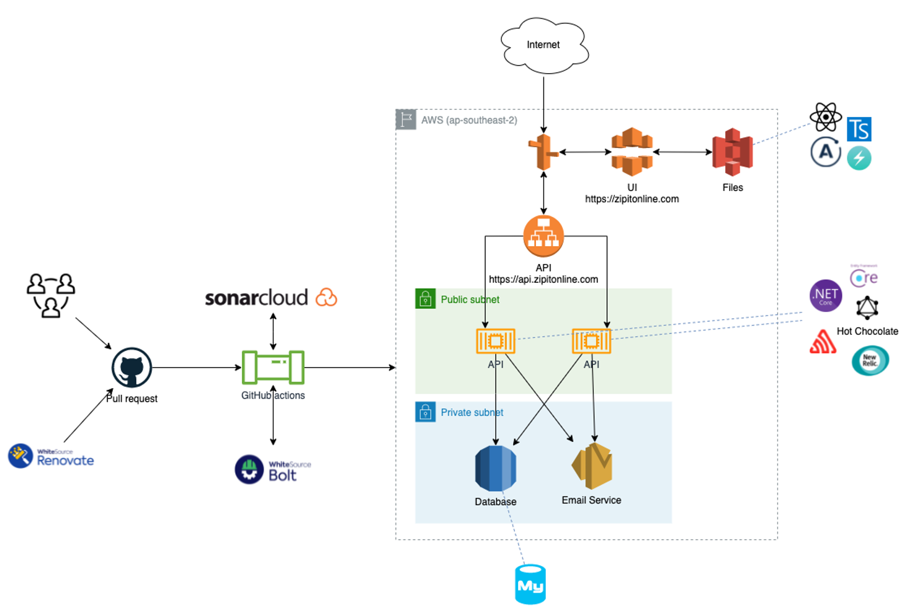

# ZipItOnline.com

  

## About

The ZipItOnline.com project is a group university project for the COSC2650 subject. A collaborative project between:

- [Connor Logan](https://github.com/verilye)
- [David Martin](https://github.com/s3204581)
- [Matt Kellock](https://github.com/mkellock)
- [Matt Papa](https://github.com/mpbeach)
- [Tom Lambert](https://github.com/s3632442)
- [Vish Inthirakumaran](https://github.com/vishnuki)

The project is a matching app, designed to display user generated advertising, searchable on a range of fields.

The production app can be found at https://zipitonline.com

## Local Operation

To run this project, you will need the following prerequisites:

- [Node.js](https://nodejs.org/en/download/)
- [.Net 6.0 SDK](https://dotnet.microsoft.com/download/dotnet/6.0)
- [MySQL](https://dev.mysql.com/downloads/)
- Install the ef core tool by running the command `dotnet tool install --global dotnet-ef --version 5.0.12`

After cloning this repository, do the following to configure your environment:

1. In your MySQL instance, create a database
2. On line 24 of `API/API/Startup.cs` add your MySQL connection string with schema edit capabilities
3. On line 4 of `UI\zip-it\src\data\client.tsx`, to use the local development API, change the URL to `http://localhost:5000/graphql`
4. In a terminal, navigate to `API/API/`
5. Run `dotnet ef database update` to populate the database schema
6. To populate the dev data, run the `db_populate.sql` file against your database
7. Run `dotnet run` to start the API server
8. Go to `http://localhost:5000/graphql` to check the API server is up
9. In a new terminal window, navigate to `UI/zip-it/`
10. Run `npm install` to install all required NPM dependencies
11. Run `npm start` to start the web server
12. Log in to the site with the credentials, username `not@real.com`, password `password`

## Prodution Architecture

Below is a diagram of the application architecture and build pipeline
